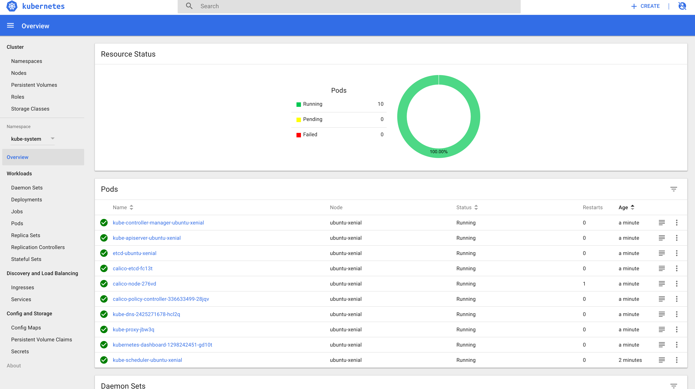

Ephemeral-env test
-------------------


# TODO:
  
  - [ ] *kubernetes*: Add Heapster

# Kubernetes
## Easy local setup

```
cd debian-box-kubernetes
sh ./local_setup.sh
```

### Access dashboard

```
kubectl --kubeconfig ./kube_config proxy
```

Open a browser there: http://localhost:8001/ui



## Manual local setup 
### Up and Running

```
$ cd debian-box
$ vagrant up

$ docker -H tcp://localhost:2375 service ls
ID                  NAME                MODE                REPLICAS            IMAGE                        PORTS
b5qnlxvig5x4        portainer           replicated          1/1                 portainer/portainer:latest   *:9000->9000/tcp 
```

### Copy kubernetes config

```
vagrant ssh -c "sudo cat /home/ubuntu/.kube/config" > kube_config
sed -i '' -e 's/10.0.2.15/kubernetes.default.svc.cluster.local/' kube_config
sudo sed -i '' -e '/localhost/ s/$/ kubernetes kubernetes.default kubernetes.default.svc kubernetes.default.svc.cluster.local/' /etc/hosts
```

### Connect with remote config

```
kubectl --kubeconfig ./kube_config get pods --all-namespaces
```

# CI/CD

## Setup a giltab runner locally to test your vagrant box

```
$ sudo curl --output /usr/local/bin/gitlab-runner https://gitlab-ci-multi-runner-downloads.s3.amazonaws.com/latest/binaries/gitlab-ci-multi-runner-darwin-amd64

$ sudo chmod +x /usr/local/bin/gitlab-runner
$ gitlab-runner install
$ gitlab-runner start
```

Get your `GITLAB_RUNNER_TOKEN` from there: `https://gitlab.lampiris.be/<group>/<project>/settings/ci_cd`


```
$ gitlab-runner register -n \
  --url http://gitlab.lam.local/ci \
  --registration-token <GITLAB_RUNNER_TOKEN> \
  --executor shell \
  --description "Vagrant local runner" \
  
```