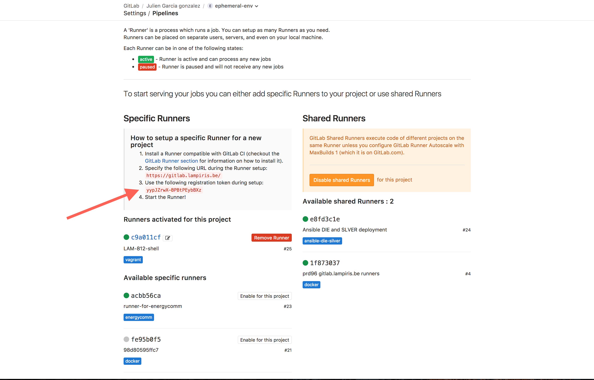

# Ephemeral-env test

## Up and Running

```
$ cd debian-box
$ vagrant up

$ docker -H tcp://localhost:2375 service ls
ID                  NAME                MODE                REPLICAS            IMAGE                        PORTS
b5qnlxvig5x4        portainer           replicated          1/1                 portainer/portainer:latest   *:9000->9000/tcp 
```

## Setup a giltab runner locally to test your vagrant box

```
$ sudo curl --output /usr/local/bin/gitlab-runner https://gitlab-ci-multi-runner-downloads.s3.amazonaws.com/latest/binaries/gitlab-ci-multi-runner-darwin-amd64

$ sudo chmod +x /usr/local/bin/gitlab-runner
$ gitlab-runner install
$ gitlab-runner start
```

Get your `GITLAB_RUNNER_TOKEN` from there: `https://gitlab.lampiris.be/<group>/<project>/settings/ci_cd`



```
$ gitlab-runner register -n \
  --url http://gitlab.lam.local/ci \
  --registration-token <GITLAB_RUNNER_TOKEN> \
  --executor shell \
  --description "Vagratn local runner" \
  
```